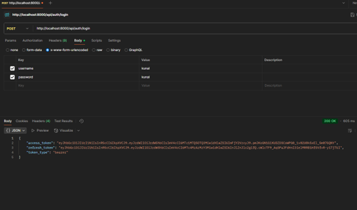
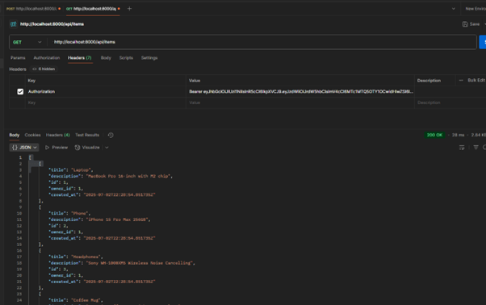

# FastAPI JWT PostgreSQL Template

FastAPI template with JWT authentication, PostgreSQL database, and comprehensive logging.

## 🚀 Features

- **FastAPI** with async support
- **JWT Authentication** with access and refresh tokens
- **PostgreSQL** with SQLAlchemy async ORM
- **Comprehensive Logging** with daily rotation

## 📋 Prerequisites

- Python 3.8+
- PostgreSQL database
- Virtual environment (recommended)

## 🛠️ Installation

1. **Clone the repository:**
   ```bash
   git clone https://github.com/kunz398/fsatApi_JWT_Postgres_Template
   cd fsatApi_JWT_Postgres_Template
   ```

2. **Create virtual environment:**
   ```bash
   python -m venv venv
   source venv/bin/activate  # On Windows: venv\Scripts\activate
   ```

3. **Install dependencies:**
   ```bash
   pip install -r requirements.txt
   ```

4. **Set up PostgreSQL database:**
   - Create a database
   - Update `.env` with your database credentials

## ⚙️ Configuration

### Environment Variables (.env)

```env
# Database Configuration
POSTGRES_USER=your_username
POSTGRES_PASSWORD=your_password
POSTGRES_DB=your_database
POSTGRES_SERVER=localhost
POSTGRES_PORT=5432

# JWT Configuration
SECRET_KEY=your_super_secret_key_here
ACCESS_TOKEN_EXPIRE_MINUTES=30
REFRESH_TOKEN_EXPIRE_DAYS=365

# Logging Configuration
LOG_LEVEL=INFO
LOG_FILE_LEVEL=INFO
LOG_CONSOLE_LEVEL=WARNING

# Optional
PROJECT_NAME=My FastAPI App
```

### Available Log Levels

| Level     | Description             | Use Case                      |
|-----------|-------------------------|-------------------------------|
| DEBUG     | Most detailed logging   | Development, troubleshooting  |
| INFO      | General information     | Production (default)          |
| WARNING   | Warnings only           | Minimal logging               |
| ERROR     | Errors only             | Critical issues only          |
| CRITICAL  | Critical errors only    | Emergency situations          |

### Generate Secret Key

```bash
python -c "import secrets; print(secrets.token_urlsafe(32))"
```

Once generated, place it in your `.env` file.

**Example:**
```bash
(venv) user@kun398:/Code/fsatApi_JWT_Postgres_Template$ python -c "import secrets; print(secrets.token_urlsafe(32))"
WCnYpmP6DfcKLwO_GrDCO7sX1I6In9iKDMbIIY5ukG0
```

## 🏃‍♂️ Running the Application

```bash
python main.py
```

## 📚 API Documentation

Once running, visit:
- **Swagger UI**: http://localhost:8000/docs
- **ReDoc**: http://localhost:8000/redoc
- **Health Check**: http://localhost:8000/health

## 🔐 Authentication Endpoints

### Register User
```bash
POST /api/auth/register
Content-Type: application/json

{
  "username": "john_doe",
  "email": "john@example.com",
  "password": "securepassword"
}
```

### Login
```bash
POST /api/auth/login
Content-Type: application/x-www-form-urlencoded

username=john_doe&password=securepassword
```

**Response:**
```json
{
  "access_token": "eyJ0eXAiOiJhY2Nlc3MiLCJleHAiOi...",
  "refresh_token": "eyJ0eXAiOiJyZWZyZXNoIiwiZXhwIjo...",
  "token_type": "bearer"
}
```

### Refresh Token
```bash
POST /api/auth/refresh
Content-Type: application/json

{
  "refresh_token": "eyJ0eXAiOiJyZWZyZXNoIiwiZXhwIjo..."
}
```

### Logout
```bash
POST /api/auth/logout
```

## 📦 Items Endpoints

All items endpoints require authentication (include `Authorization: Bearer <access_token>` header).

### Create Item
```bash
POST /api/items/
Authorization: Bearer <access_token>
Content-Type: application/json

{
  "title": "My Item",
  "description": "Item description"
}
```

### Get Items
```bash
GET /api/items/?skip=0&limit=10
Authorization: Bearer <access_token>
```

### Get Item by ID
```bash
GET /api/items/{item_id}
Authorization: Bearer <access_token>
```

### Delete Item
```bash
DELETE /api/items/{item_id}
Authorization: Bearer <access_token>
```
## 📸 Postman Examples

### Get Token


### Get Item (with token)



## 📊 Logging

Logs are stored in the `logs/` directory:
- `app.log` - All application logs
- `error.log` - Error-only logs
- Daily rotation with 30-day retention
- For unlimited retention, change `backupCount` to 0 in `core/logging.py`

### View Logs
```bash
# View current logs
tail -f logs/app.log

# View errors only
tail -f logs/error.log

# View all logs
tail -f logs/*.log
```

## 🏗️ Project Structure

```
fsatApi_JWT_Postgres_Template/
├── app/
│   ├── core/
│   │   ├── config.py          # Environment configuration
│   │   ├── database.py        # Database connection
│   │   ├── logging.py         # Logging configuration
│   │   └── security.py        # JWT and password utilities
│   ├── models/
│   │   ├── user.py            # User database model
│   │   └── item.py            # Item database model
│   ├── routers/
│   │   ├── auth.py            # Authentication endpoints
│   │   └── items.py           # Items CRUD endpoints
│   ├── schemas/
│   │   ├── user.py            # User Pydantic schemas
│   │   └── item.py            # Item Pydantic schemas
│   └── main.py                # FastAPI application
├── logs/                      # Application logs
├── .env                       # Environment variables
├── requirements.txt           # Python dependencies
├── main.py                    # Application entry point
└── README.md                  # This file
```

## 🔧 Customization

### Adding New Models

1. Create model in `app/models/`
2. Create schemas in `app/schemas/`
3. Create router in `app/routers/`
4. Import and include router in `app/main.py`

### Database Migrations

Once you have set up your `.env` with proper database connections and run your application from `main.py`, the app will look for the user table. If none exists, it will create users and an item table as a startup base.

### Sample Data

To populate your database with test data, you can run the provided SQL script:

```bash
psql -U your_username -d your_database -f scripts/insert_sample_data.sql
```

This will insert sample users and items to help you test the API endpoints.

## 🚀 Deployment

### Docker

Create a `Dockerfile`:
```dockerfile
FROM python:3.11-slim

WORKDIR /app
COPY requirements.txt .
RUN pip install -r requirements.txt

COPY . .
EXPOSE 8000

CMD ["uvicorn", "app.main:app", "--host", "0.0.0.0", "--port", "8000"]
```
------------------------
------------------------

# Testing Application - Terminal base 

A console-based testing application for the FastAPI JWT template. This standalone application tests all API endpoints and provides both automated and interactive testing modes.

## 🚀 Features

- **Comprehensive Test Suite** - Tests all API endpoints automatically
- **Interactive Mode** - Command-line interface for manual testing
- **User Management** - Register, login, logout users
- **Item Management** - Create, read, delete items
- **Token Management** - Test JWT access and refresh tokens
- **Real-time Feedback** - Clear success/error messages
- **Menu-driven Interface** - Easy navigation between test options

## 📋 Prerequisites

- Python 3.8+
- FastAPI application running (default: http://localhost:8000)
- PostgreSQL database with sample data (optional)

## 🛠️ Installation

1. **Navigate to the test directory:**
   ```bash
   cd test_template_code
   ```

2. **Install dependencies:**
   ```bash
   pip install -r requirements.txt
   ```

3. **Start your FastAPI application:**
   ```bash
   # In another terminal, from the main project directory
   python main.py
   # or
   sh run_test.sh #if windows run_test.bat
   ```

## 🎯 Usage

### Quick Start
```bash
python test_api.py
#  or
sh run_test.sh
```

### Menu Options

1. **Run Comprehensive Test Suite** - Automated testing of all endpoints
2. **Test Health Check** - Verify API is running
3. **Test User Registration** - Register new users
4. **Test User Login** - Login with credentials
5. **Test Item Creation** - Create new items
6. **Test Item Listing** - List user's items
7. **Test Item Deletion** - Delete items by ID
8. **Test Token Refresh** - Refresh access tokens
9. **Test User Logout** - Logout current user
10. **Interactive Mode** - Command-line interface

## 🎮 Interactive Mode

Interactive mode provides a command-line interface for manual testing:

```bash
> login testuser1 password123
✅ User testuser1 logged in successfully

> create "Test Item" "This is a test item"
✅ Item 'Test Item' created successfully

> list
✅ Retrieved 1 items
  📦 ID: 1 | Title: Test Item | Description: This is a test item

> delete 1
✅ Item 1 deleted successfully

> logout
✅ Logout successful
```

### Available Commands

| Command | Description | Usage |
|---------|-------------|-------|
| `login` | Login user | `login <username> <password>` |
| `logout` | Logout user | `logout` |
| `register` | Register user | `register <username> <email> <password>` |
| `create` | Create item | `create <title> [description]` |
| `list` | List items | `list` |
| `get` | Get item | `get <id>` |
| `delete` | Delete item | `delete <id>` |
| `refresh` | Refresh token | `refresh` |
| `status` | Show status | `status` |
| `help` | Show help | `help` |
| `exit` | Exit mode | `exit` or `quit` |

## 🧪 Test Scenarios

### 1. Basic API Health
- Health check endpoint
- Root endpoint
- Connection verification

### 2. User Authentication
- User registration
- User login
- User logout
- Token refresh
- Invalid credentials handling

### 3. Item Management
- Create items
- List user items
- Get specific item
- Delete items
- Authorization checks

### 4. Token Management
- Access token validation
- Refresh token usage
- Token expiration handling

## 📊 Sample Test Output

```
🚀 FastAPI JWT Template - Console Testing Application
============================================================
Enter API base URL (default: http://localhost:8000): 

============================================================
 TEST MENU
============================================================
1. Run Comprehensive Test Suite
2. Test Health Check
3. Test User Registration
4. Test User Login
5. Test Item Creation
6. Test Item Listing
7. Test Item Deletion
8. Test Token Refresh
9. Test User Logout
10. Interactive Mode
0. Exit

Select an option (0-10): 1

============================================================
 FASTAPI JWT TEMPLATE - COMPREHENSIVE TEST SUITE
============================================================
Testing API at: http://localhost:8000
Timestamp: 2024-03-07 10:30:00

============================================================
 Health Check Test
============================================================
✅ Health check passed
ℹ️  Status: healthy

============================================================
 User Registration: testuser1
============================================================
✅ User testuser1 registered successfully
ℹ️  User ID: 1

============================================================
 User Login: testuser1
============================================================
✅ User testuser1 logged in successfully
ℹ️  Access token: eyJ0eXAiOiJhY2Nlc3MiLCJleHAiOi...
ℹ️  Refresh token: eyJ0eXAiOiJyZWZyZXNoIiwiZXhwIjo...

============================================================
 Create Item: Test Laptop
============================================================
✅ Item 'Test Laptop' created successfully
ℹ️  Item ID: 1
```

## 🔧 Configuration

### Custom API URL
You can specify a custom API URL when starting the application:
```bash
python test_api.py
# Then enter: http://your-api-url:port
```

### Environment Variables
The application uses the following defaults:
- **API URL**: http://localhost:8000
- **Timeout**: 30 seconds per request

## 🐛 Troubleshooting

### Common Issues

1. **Connection Failed**
   - Ensure FastAPI application is running
   - Check if the URL is correct
   - Verify firewall settings

2. **Authentication Errors**
   - Check if users exist in database
   - Verify password is correct
   - Ensure JWT tokens are valid

3. **Database Errors**
   - Run the sample data script first
   - Check database connection
   - Verify table structure

### Debug Mode
For detailed error information, the application shows:
- HTTP status codes
- Response data
- Error messages
- Stack traces (when applicable)

## 📝 Important Notes

### Test Environment
- **Data Persistence**: Test data remains in the database after testing sessions
- **Security**: Real JWT tokens are used for authentication testing
- **Logging**: All API interactions are logged with detailed timestamps for debugging

### Test Directory Management
The `test_template_code` directory contains standalone testing utilities designed to verify the main application functionality. You can safely remove this directory if:
- You no longer need to test the API endpoints
- You prefer to use your own testing framework
- You want to clean up the project structure

**Note**: Removing the test directory will <u>not</u> affect the main application functionality.

## Example

```
(venv) useri@kunal:/Code/fsatApi_JWT_Postgres_Template$ cd test_template_code/
(venv) useri@kunal:/Code/fsatApi_JWT_Postgres_Template/test_template_code$ ./run_tests.sh 
🚀 Starting FastAPI JWT Template Testing Application...

📦 Checking dependencies...

🎯 Starting test application...
============================================================
 FastAPI JWT Template - Console Testing Application
============================================================
Enter API base URL (default: http://localhost:8000) ↵

============================================================
🔓 Not authenticated - Please login or register first
============================================================

 TEST MENU
============================================================
1. Run Comprehensive Test Suite
2. Test Health Check
3. Test User Registration
4. Test User Login
5. Test Item Creation
6. Test Item Listing
7. Test Item Deletion
8. Test Token Refresh
9. Test User Logout
10. Interactive Mode
11. Show Current Status
0. Exit

Select an option (0-11): 4
Enter username: kunal ↵
Enter password: kunal ↵

============================================================
 User Login: kunal
============================================================
✅ User kunal logged in successfully
ℹ️  Access token: eyJhbGciOiJIUzI1NiIs...
ℹ️  Refresh token: eyJhbGciOiJIUzI1NiIs...

Press Enter to continue... ↵


============================================================
🔐 Logged in as: kunal
   Access Token: ✅ Valid
   Refresh Token: ✅ Valid
============================================================

 TEST MENU
============================================================
1. Run Comprehensive Test Suite
2. Test Health Check
3. Test User Registration
4. Test User Login
5. Test Item Creation
6. Test Item Listing
7. Test Item Deletion
8. Test Token Refresh
9. Test User Logout
10. Interactive Mode
11. Show Current Status
0. Exit

Select an option (0-11): 6

============================================================
 Get All Items
============================================================
✅ Retrieved 27 items
ℹ️  ID: 1 - Laptop - MacBook Pro 16-inch with M2 chip - Created: 2025-07-02 22:28:54
ℹ️  ID: 2 - Phone - iPhone 15 Pro Max 256GB - Created: 2025-07-02 22:28:54
ℹ️  ID: 3 - Headphones - Sony WH-1000XM5 Wireless Noise Cancelling - Created: 2025-07-02 22:28:54
ℹ️  ID: 4 - Coffee Mug - Ceramic coffee mug with company logo - Created: 2025-07-02 22:28:54
ℹ️  ID: 5 - Notebook - Moleskine Classic Notebook, Large - Created: 2025-07-02 22:28:54
ℹ️  ID: 6 - Desk Chair - Ergonomic office chair with lumbar support - Created: 2025-07-02 22:28:54
ℹ️  ID: 7 - Monitor - 27-inch 4K Ultra HD Monitor - Created: 2025-07-02 22:28:54
ℹ️  ID: 8 - Keyboard - Mechanical keyboard with RGB backlight - Created: 2025-07-02 22:28:54
ℹ️  ID: 9 - Mouse - Wireless gaming mouse with precision sensor - Created: 2025-07-02 22:28:54
ℹ️  ID: 10 - Plant - Indoor succulent plant in ceramic pot - Created: 2025-07-02 22:28:54
ℹ️  ID: 11 - Books - Collection of programming and design books - Created: 2025-07-02 22:28:54
ℹ️  ID: 12 - Server - Dell PowerEdge R740 Server - Created: 2025-07-02 22:28:54
ℹ️  ID: 13 - Network Switch - Cisco Catalyst 2960-X Series - Created: 2025-07-02 22:28:54
ℹ️  ID: 14 - Backup Drive - 4TB External Hard Drive for backups - Created: 2025-07-02 22:28:54
ℹ️  ID: 15 - Security Camera - IP Security Camera with night vision - Created: 2025-07-02 22:28:54
ℹ️  ID: 16 - VPN Router - Enterprise-grade VPN router - Created: 2025-07-02 22:28:54
ℹ️  ID: 17 - test - api test creation - Created: 2025-07-02 22:56:05
ℹ️  ID: 19 - Test Item 1 - This is a test item - Created: 2025-07-02 23:00:44
ℹ️  ID: 20 - Test Item 2 - Another test item - Created: 2025-07-02 23:00:44
ℹ️  ID: 21 - Test Item 1 - This is a test item - Created: 2025-07-02 23:01:45
ℹ️  ID: 22 - Test Item 2 - Another test item - Created: 2025-07-02 23:01:45
ℹ️  ID: 23 - Test Item 1 - This is a test item - Created: 2025-07-02 23:13:15
ℹ️  ID: 24 - Test Item 2 - Another test item - Created: 2025-07-02 23:13:15
ℹ️  ID: 25 - Test Item 1 - This is a test item - Created: 2025-07-02 23:56:13
ℹ️  ID: 26 - Test Item 2 - Another test item - Created: 2025-07-02 23:56:13
ℹ️  ID: 27 - Test Item 1 - This is a test item - Created: 2025-07-02 23:56:36
ℹ️  ID: 28 - Test Item 2 - Another test item - Created: 2025-07-02 23:56:37

💡 Tip: If no items are shown, try creating some items first using option 5!

Press Enter to continue...
```